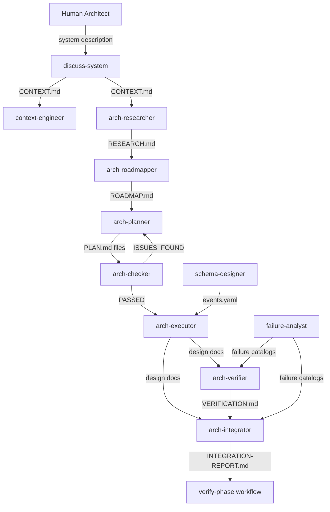

# Architecture GSD — Agent Topology

## System Overview

Architecture GSD is an 11-agent multi-agent architecture design system. The agents collaborate
in a structured pipeline: intake → research → roadmap → plan/check → execute → verify/integrate.
All agents communicate via disk files (disk-as-shared-memory pattern). No in-memory channels.

## Agent Dependency Graph



## Communication Channels

| From Agent | To Agent | Mechanism | Data Type | Direction |
|-----------|----------|-----------|-----------|-----------|
| discuss-system | context-engineer | File (CONTEXT.md) | YAML frontmatter | One-way write |
| discuss-system | arch-researcher | File (CONTEXT.md) | YAML frontmatter | One-way read |
| arch-researcher | arch-roadmapper | File (RESEARCH.md) | Markdown + YAML | One-way read |
| arch-roadmapper | arch-planner | File (ROADMAP.md) | Markdown + YAML | One-way read |
| arch-planner | arch-checker | Files (PLAN.md files) | XML-structured Markdown | One-way read |
| arch-checker | arch-planner | Structured return | JSON | Direct return (iteration) |
| arch-checker | execute-phase | Structured return | JSON (PASSED/ISSUES_FOUND) | Direct return |
| arch-planner | execute-phase | Structured return | JSON (plan paths) | Direct return |
| schema-designer | arch-executor | File (events.yaml) | YAML | One-way read |
| schema-designer | execute-phase | Structured return | JSON | Direct return |
| arch-executor | design/ | Files (design docs) | Markdown + YAML | One-way write |
| arch-executor | execute-phase | Structured return | JSON | Direct return |
| design/ docs | arch-verifier | Files (design docs) | Markdown + YAML | One-way read |
| arch-verifier | verify-phase | File (VERIFICATION.md) + JSON | YAML + JSON | One-way write + return |
| design/ docs | arch-integrator | Files (design docs) | Markdown + YAML | One-way read |
| VERIFICATION.md | arch-integrator | File (VERIFICATION.md) | YAML frontmatter | One-way read |
| arch-integrator | verify-phase | File (INTEGRATION-REPORT.md) + JSON | Markdown + JSON | One-way write + return |
| failure-analyst | design/ | Files (failure catalogs) | Markdown | One-way write |
| context-engineer | CONTEXT.md | File (CONTEXT.md) | YAML frontmatter | Edit |
| verify-phase | human | REVIEW prompt | Text | Blocking interaction |

## Orchestration Model

**Entry points:**
- `/arch-gsd:new-system` — spawns discuss-system, validates CONTEXT.md
- `/arch-gsd:execute-phase N` — spawns arch-researcher (Wave 1), arch-roadmapper (Wave 2), arch-planner (Wave 3), arch-checker (Wave 3, iteration), arch-executor (Wave 4+)
- `/arch-gsd:verify-phase N` — spawns arch-verifier (Wave 1), arch-integrator (Wave 2), writes MANIFEST.md and DIGEST.md (Wave 3)

**Wave execution:** Plans within the same wave are spawned simultaneously as Task() calls.
The orchestrator awaits all same-wave Task() completions before advancing to the next wave.
This creates a barrier synchronization pattern for design artifact dependencies.

**Bounded revision loop:** arch-planner ↔ arch-checker iterate at most 3 rounds per phase.
The execute-phase orchestrator enforces this cap. After 3 failed iterations, the orchestrator
returns human_needed with the unresolved issue list.

```yaml
canonical:
  topology:
    nodes:
      - discuss-system
      - context-engineer
      - arch-researcher
      - arch-roadmapper
      - arch-planner
      - arch-checker
      - arch-executor
      - arch-verifier
      - arch-integrator
      - schema-designer
      - failure-analyst
    edges:
      - from: discuss-system
        to: context-engineer
        mechanism: file
        data_type: yaml
        file: .arch/CONTEXT.md
      - from: discuss-system
        to: arch-researcher
        mechanism: file
        data_type: yaml
        file: .arch/CONTEXT.md
      - from: arch-researcher
        to: arch-roadmapper
        mechanism: file
        data_type: markdown
        file: .arch/RESEARCH.md
      - from: arch-roadmapper
        to: arch-planner
        mechanism: file
        data_type: markdown
        file: .arch/ROADMAP.md
      - from: arch-planner
        to: arch-checker
        mechanism: file
        data_type: markdown
        file: .arch/phases/{phase}/*.md
      - from: arch-checker
        to: arch-planner
        mechanism: structured-return
        data_type: json
        pattern: bounded-revision-loop (max 3 iterations)
      - from: schema-designer
        to: arch-executor
        mechanism: file
        data_type: yaml
        file: design/events/events.yaml
      - from: arch-executor
        to: arch-verifier
        mechanism: file
        data_type: markdown
        file: design/{type}/{name}.md
      - from: arch-verifier
        to: arch-integrator
        mechanism: file
        data_type: yaml
        file: design/VERIFICATION.md
      - from: failure-analyst
        to: arch-verifier
        mechanism: file
        data_type: markdown
        file: design/failure-modes/{agent}-failures.md
```
