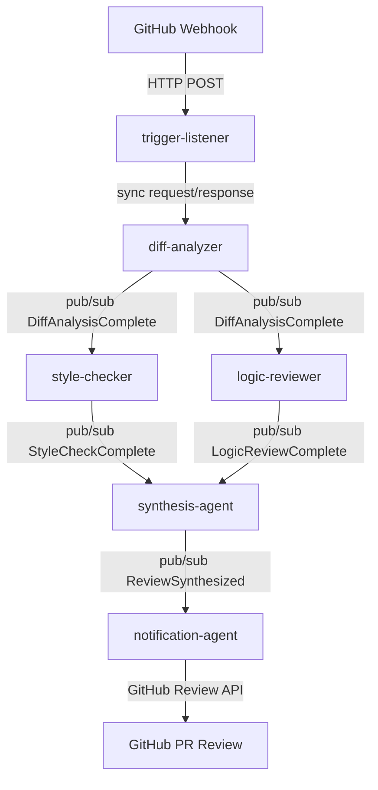

# System Topology: Code Review Automation Pipeline

## Agent Dependency Graph



**Communication boundary:** The sync/async boundary is at diff-analyzer. trigger-listener → diff-analyzer uses synchronous request/response (per locked-decision in CONTEXT.md). All downstream agents communicate via event-driven pub/sub on the message bus (Redis Streams).

## Communication Channels

| From Agent | To Agent | Mechanism | Data Type | Direction | Event/Call |
|------------|----------|-----------|-----------|-----------|-----------|
| GitHub Webhook | trigger-listener | HTTP POST | JSON (webhook payload) | inbound | — |
| trigger-listener | diff-analyzer | Sync HTTP POST or in-process RPC | JSON (PullRequestReceived) | sync request/response | PullRequestReceived |
| diff-analyzer | style-checker | Redis Streams pub/sub | JSON (DiffAnalysisComplete) | async fanout | DiffAnalysisComplete |
| diff-analyzer | logic-reviewer | Redis Streams pub/sub | JSON (DiffAnalysisComplete) | async fanout | DiffAnalysisComplete |
| style-checker | synthesis-agent | Redis Streams pub/sub | JSON (StyleCheckComplete) | async | StyleCheckComplete |
| logic-reviewer | synthesis-agent | Redis Streams pub/sub | JSON (LogicReviewComplete) | async | LogicReviewComplete |
| synthesis-agent | notification-agent | Redis Streams pub/sub | JSON (ReviewSynthesized) | async | ReviewSynthesized |
| notification-agent | GitHub PR | GitHub REST API | JSON (review + comments) | outbound | NotificationSent |

## Topology YAML Canonical Block

```yaml
topology:
  nodes:
    - trigger-listener
    - diff-analyzer
    - style-checker
    - logic-reviewer
    - synthesis-agent
    - notification-agent
  edges:
    - from: trigger-listener
      to: diff-analyzer
      mechanism: sync-rpc
      data_type: json
      event: PullRequestReceived
      note: "sync request/response boundary — locked-decision in CONTEXT.md"
    - from: diff-analyzer
      to: style-checker
      mechanism: event
      data_type: json
      event: DiffAnalysisComplete
      note: "pub/sub fanout — style-checker subscribes independently"
    - from: diff-analyzer
      to: logic-reviewer
      mechanism: event
      data_type: json
      event: DiffAnalysisComplete
      note: "pub/sub fanout — logic-reviewer subscribes independently"
    - from: style-checker
      to: synthesis-agent
      mechanism: event
      data_type: json
      event: StyleCheckComplete
    - from: logic-reviewer
      to: synthesis-agent
      mechanism: event
      data_type: json
      event: LogicReviewComplete
    - from: synthesis-agent
      to: notification-agent
      mechanism: event
      data_type: json
      event: ReviewSynthesized
    - from: notification-agent
      to: github-pr
      mechanism: http-api
      data_type: json
      event: NotificationSent
      note: "GitHub REST API — external system boundary"
  external_boundaries:
    - name: github-webhook
      type: inbound
      agent: trigger-listener
    - name: github-pr
      type: outbound
      agent: notification-agent
  message_bus:
    technology: Redis Streams
    consumer_groups:
      - name: pr-analysis
        producers: [diff-analyzer]
        consumers: [style-checker, logic-reviewer]
      - name: pr-synthesis
        producers: [style-checker, logic-reviewer]
        consumers: [synthesis-agent]
      - name: pr-delivery
        producers: [synthesis-agent]
        consumers: [notification-agent]
```

## Topology Notes

**Sync/Async Boundary:** The pipeline has a single sync/async boundary at diff-analyzer. This boundary is architecturally significant: the sync call from trigger-listener to diff-analyzer ensures the diff is fully available before any analysis begins, preventing style-checker and logic-reviewer from receiving partial diffs. After diff-analyzer publishes DiffAnalysisComplete, all downstream communication is asynchronous.

**Parallel Analysis:** style-checker and logic-reviewer both subscribe to DiffAnalysisComplete independently (fanout pattern). They execute concurrently — neither waits for the other. synthesis-agent implements the Aggregator pattern, waiting for both StyleCheckComplete and LogicReviewComplete before synthesizing.

**Dead-Letter Handling:** Each Redis Streams consumer group has a dead-letter mechanism (XAUTOCLAIM after processing timeout) to recover messages not acknowledged by consumers. Failed messages accumulate in the consumer group's pending-entries list for operator inspection.
